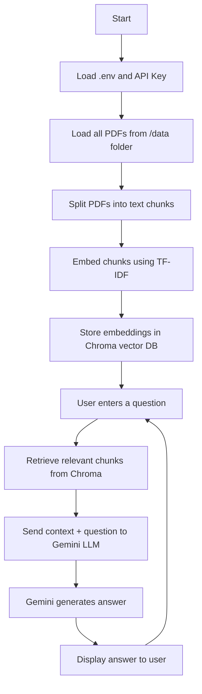

# PDF Agent Gemini – RAG Pipeline

## What is RAG?

**RAG** stands for **Retrieval-Augmented Generation**.  
It is an AI architecture that combines two main components:
- **Retriever:** Finds relevant information from a knowledge base (like documents or databases) based on a user’s query.
- **Generator (LLM):** Uses a large language model to generate answers, leveraging both the retrieved information and its own knowledge.

This approach allows the AI to provide more accurate, up-to-date, and context-aware answers, especially when the information is not part of the LLM’s training data.

---

## Project Overview

This project is a **PDF Question Answering Agent** using RAG with Google Gemini as the LLM.  
It allows you to ask questions about the content of PDF files in a local folder. The system retrieves relevant text chunks from your PDFs using a local TF-IDF embedding, then sends those chunks to Gemini for answer generation.

**Key Features:**
- Loads and processes all PDFs in a specified folder.
- Splits documents into manageable text chunks.
- Embeds chunks using local TF-IDF (no internet required for embeddings).
- Stores embeddings in a local vector database (Chroma).
- Uses Gemini (`gemini-2.0-flash`) for answer generation.
- Interactive command-line interface for asking questions.

---

## Project Structure & File Explanations

| File Name                | Purpose                                                                 |
|--------------------------|-------------------------------------------------------------------------|
| `main.py`                | Main application script. Loads PDFs, builds the RAG pipeline, and runs the Q&A loop. |
| `requirements.txt`       | Lists all required Python packages for the project.                     |
| `.env`                   | Stores your Google Gemini API key securely.                             |
| `testgeminikey.py`       | Simple script to test if your Gemini API key is working.                |
| `testgemini.bat`         | Batch file to test Gemini API access using `curl` (for troubleshooting).|
| `run_main_with_cert.py`  | (Not needed in current setup) Was used for SSL troubleshooting.         |
| `data/`                  | Folder where you place your PDF files for analysis.                     |

---

## Flow Chart



---

## How It Works (Step-by-Step)

1. **Environment Setup:**  
   - Loads your Gemini API key from `.env`.

2. **PDF Loading:**  
   - Reads all PDF files in the `data/` folder and extracts their text.

3. **Chunking:**  
   - Splits the extracted text into overlapping chunks for better retrieval.

4. **Embedding:**  
   - Each chunk is converted into a TF-IDF vector (local, no downloads).

5. **Vector Store:**  
   - All vectors are stored in a local Chroma database for fast similarity search.

6. **User Query:**  
   - You type a question in the terminal.

7. **Retrieval:**  
   - The system finds the most relevant chunks from your PDFs.

8. **Generation:**  
   - The question and retrieved context are sent to Gemini, which generates an answer.

9. **Display:**  
   - The answer is shown in your terminal.

---

## Notes

- **No SSL/Internet required for embeddings:** All document processing and embedding is local.
- **Internet required for Gemini:** Only the LLM (Gemini) requires internet access and a valid API key.
- **Add PDFs:** Place your PDF files in the `data/` folder before running the app.

---

## Getting Started

1. Install dependencies:
   ```
   pip install -r requirements.txt
   ```
2. Add your Gemini API key to `.env`:
   ```
   GOOGLE_API_KEY=your_actual_api_key
   ```
3. Place your PDFs in the `data/` folder.
4. Run the app:
   ```
   python main.py
   ```

---

## Example Usage

```
Ask a question (or type 'exit'): What is the main topic of document X?
Answer: [Gemini's answer based on your PDFs]
```

---

## License

This project is for educational
